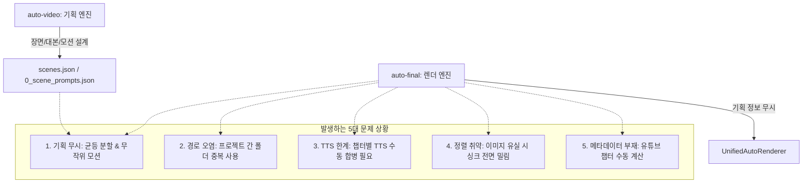

# auto-final 협업 계획 및 워크플로우 검토 보고서

본 보고서는 `auto-final-collaboration-plan.md` 계획서와 `auto-final` 및 `auto-video` 양쪽의 코드베이스, 그리고 실제 제작 워크플로우를 정밀 분석하여 **1~2시간 장편 '꿀잠성경' 비디오 제작 파이프라인에서 직면하게 될 5대 기술적/구조적 문제점**을 진단하고, 이를 극복하기 위한 구체적인 솔루션 및 코드 레벨의 개선 방안을 제안합니다.

---

## 1. 종합 요약 (Executive Summary)

* **협업 방향의 적합성**: 기획/대본/이미지 기획은 창작 엔진인 `auto-video`가 담당하고, TTS/렌더링/자막/필터 처리는 포스트 프로덕션 엔진인 `auto-final`이 전담하도록 설계된 역할 분리(Role Separation)는 매우 합리적이며 시스템 중복 개발을 방지합니다.
* **핵심 취약점 (5대 Gap)**:
  1. **기획 타임라인과 렌더 엔진의 단절 (Timeline & Motion Disconnect)**: `auto-video`에서 정교하게 배치한 장면별 재생 구간(`scenes.json`)과 카메라 모션 기획이 실제 `auto-final` 렌더링 시 무시되고, 단순 균등 분할 및 무작위 모션으로 강제 덮어쓰기됩니다.
  2. **단일 프로젝트 경로 오염 (Project Path Pollution)**: `auto-final`이 단일 `input/`, `work/`, `output/` 전역 디렉토리 구조만 사용하므로, 여러 에피소드를 병렬로 작업할 때 캐시 충돌 및 구버전 파일 혼입에 취약합니다.
  3. **장시간 TTS 챕터 병합 자동화 공백 (TTS Merging & Offset Gap)**: 수면 콘텐츠 특성상 1~2시간 분량의 오디오를 한 번에 생성하기 힘들어 챕터 단위 생성이 권장되나, 쪼개진 여러 `WAV`와 `SRT` 파일을 누적 시간에 비례해 이어붙여 주는(SRT Offset Shift) 자동 어댑터가 존재하지 않습니다.
  4. **이미지 파일 넘버링 유실 시 싱크 전면 붕괴 (Image Sequence Vulnerability)**: 파일명 정렬에 의존하므로, 사용자 실수로 수백 장 중 단 한 장의 이미지 파일만 빠져도 그 뒤에 배치된 수백 분량의 모든 이미지 싱크가 1칸씩 밀리는 파국적 정렬 에러가 발생합니다.
  5. **유튜브용 챕터 타임라인 메타데이터의 부재 (Missing YouTube Chapters)**: 롱폼 수면 영상에서 시청자 탐색에 필수적인 타임라인/챕터 텍스트가 최종 렌더 완료 후 자동으로 추출되지 않아 수동 계산이 요구됩니다.

---

## 2. 5대 핵심 문제점 및 워크플로우 공백 분석



### ① 기획 타임라인과 실제 렌더러 동작의 불일치 (Scene Timing & Motion Gap)
* **현상**:
  * `auto-video`는 각 장면에 어울리는 재생 타이밍(내레이션 단락 매칭)과 전용 카메라 모션(예: slow zoom, slow pan)을 기획하여 `scenes.json` 및 `0_scene_prompts.json`으로 내보냅니다.
  * 그러나 `auto-final`의 `UnifiedAutoRenderer`는 `discover_unified_inputs`로 입력 폴더의 이미지 파일 목록만 단순히 읽어 들인 후, [timeline_allocator.py](file:///C:/Users/petbl/auto-final/src/auto_video/timeline_allocator.py#L6-L34)에서 `allocate_even_visual_slots` 함수를 호출해 **전체 오디오 길이에 맞추어 균등 분할**합니다. 또한 [motion_planner.py](file:///C:/Users/petbl/auto-final/src/auto_video/motion_planner.py#L30-L46)에서 **모든 이미지를 무작위 모션으로 강제 덮어씌웁니다**.
* **영향**: 창작 단계에서 아무리 정교하게 "아담이 선악과를 한 입 베어 무는 순간"에 맞추어 이미지를 매핑하고 "slow zoom in" 모션을 기획해도, 실제 렌더 영상에서는 내레이션 흐름과 무관하게 엉뚱한 배경 이미지가 렌더링되거나 어울리지 않는 무작위 모션(예: 급격한 pan_down)이 걸리게 됩니다.

### ② 단일 프로젝트 구조로 인한 데이터 오염 (Project Path Pollution)
* **현상**:
  * `auto-final`의 [default.yaml](file:///C:/Users/petbl/auto-final/config/default.yaml#L7-L12)과 `UnifiedAutoRenderer`는 프로젝트 루트의 `input/`, `work/`, `output/` 폴더를 전역 공용 공간으로 사용하도록 설계되어 있습니다.
  * `auto-video`에서 내보낸 에피소드 패키지를 이 폴더들에 덮어씌우는 방식으로 동작합니다.
* **영향**:
  * 이전 에피소드 작업 시 만들어진 이미지(`1.jpg`, `2.jpg` 등)나 캐시 파일들이 `input/` 및 `work/` 폴더에 그대로 남아있어, 다음 에피소드 렌더링 시 구버전 자산이 병입되는 파일 오염(Path Contamination)이 발생하기 쉽습니다.
  * `work/clips` 캐시 충돌로 인해 이전 에피소드의 렌더링 결과물이 재사용되는 끔찍한 오작동이 나타날 수 있습니다.

### ③ 장시간 TTS 챕터 병합의 한계와 공백 (WAV/SRT Concatenation Gap)
* **현상**:
  * 1~2시간(60~120분) 분량의 대본(글자 수 1.5만~3.4만 자)을 한 번에 Supertonic 로컬 TTS API로 호출하면 서버 타임아웃, 메모리 제한, 혹은 음성 합성 왜곡 현상이 매우 쉽게 발생합니다.
  * 계획서에서는 이를 방지하기 위해 "20~30분 단위의 챕터로 쪼개어 TTS를 생성한다"고 제안하지만, 정작 `auto-final`은 단일 오디오 파일 `0_tts.wav`와 단일 자막 파일 `0_tts.srt`만 받아 렌더링을 진행합니다.
* **영향**:
  * 사용자가 직접 외부 사운드 편집 프로그램으로 여러 챕터의 `.wav` 파일을 정밀하게 합쳐서 단일 파일로 렌더링해야 합니다.
  * 가장 큰 문제는 **자막(SRT) 합병**입니다. 2챕터 자막은 1챕터의 총 재생 시간만큼 모든 타임스탬프를 더해주는(Offset Shift) 복잡한 텍스트 변환 처리가 수동으로 수행되어야 하며, 이를 놓치면 2챕터부터 자막 싱크가 완전히 어긋납니다.

### ④ 이미지 파일 정렬(Index Shift) 취약성 및 싱크 전면 붕괴
* **현상**:
  * `auto-final`은 `input/` 폴더 내의 이미지 파일들을 단순히 숫자로 오름차순 정렬하여 순서대로 할당합니다.
  * 만약 사용자가 Imagen/구글 플로우 등에서 이미지 500장을 생성해 번호를 매겨 다운로드하던 중, 실수로 중간 번호인 `45.jpg`를 빠뜨리게 된다면 어떻게 될까요?
* **영향**:
  * 렌더러는 에러를 내지 않고 단순히 46번 이미지를 45번째 슬롯에 배정합니다.
  * 결과적으로 `45.jpg` 누락 시점 이후인 **46번부터 500번까지의 모든 이미지와 대본/오디오의 싱크가 1칸씩 강제로 당겨져 매치**되는 파국적 싱크 붕괴가 발생합니다. (기획에 맞춘 이미지 앵글이 완전히 무너집니다.)

### ⑤ 유튜브 타임라인(챕터) 메타데이터 자동 추출 기능의 부재
* **현상**:
  * 1~2시간 분량의 장편 롱폼 영상은 시청자들이 원하는 성경 구절이나 심리학 챕터를 찾기 쉽게 유튜브 설명란에 챕터 목록(예: `05:12 에덴동산은 정말 낙원이었을까`)을 제공해 주는 것이 필수적입니다.
  * 현재 `auto-final`은 최종 렌더 완료 후 `output/report.json`을 내보내지만, 유튜브 업로드 시 그대로 붙여넣을 수 있는 타임라인 메타데이터 파일은 생성하지 않습니다.
* **영향**: 사용자는 동영상이 최종 출력된 후에 직접 비디오 플레이어로 재생해보거나, 오디오 길이를 하나하나 합산해가며 수동으로 타임코드를 계산해야 하는 엄청난 시간 낭비를 감수해야 합니다.

---

## 3. 코드 레벨의 구체적인 진단 및 개선 계획

기존 `auto-final` 코드베이스를 검토하여, 위의 워크플로우 공백들을 최소한의 부작용으로 깔끔하게 개선할 수 있는 코드 레벨의 해결 전략을 도출했습니다.

### [진단 1] `auto_render.py`의 타임라인 결정 로직 우회 지원

* **대상 파일**: [src/auto_video/auto_render.py](file:///C:/Users/petbl/auto-final/src/auto_video/auto_render.py#L85-L114) 및 [src/auto_video/execution_planner.py](file:///C:/Users/petbl/auto-final/src/auto_video/execution_planner.py#L27-L62)
* **문제점**: `build_deterministic_execution_plan`은 무조건 `allocate_even_visual_slots`를 통해 균등 분할 슬롯만 리턴합니다.
* **해결 제안**: 만약 입력 폴더에 `0_scene_prompts.json` (또는 `scenes.json`) 파일이 감지될 경우, 균등 분할을 우회하고 **기획서에 명시된 타이밍과 모션을 반영하는 커스텀 슬롯 맵핑 분기**를 추가합니다.

#### **개선 코드 스케치 (auto_render.py / execution_planner.py)**
```python
# execution_planner.py 또는 auto_render.py에 탑재할 기획 기반 타임라인 파서 예시
import json
from pathlib import Path

def build_planned_execution_plan(
    scan: dict[str, Any],
    probe: dict[str, Any],
    render: dict[str, Any],
    scene_prompt_path: Path,
) -> dict[str, Any]:
    with open(scene_prompt_path, encoding="utf-8") as f:
        prompt_data = json.load(f)
        
    scenes = prompt_data.get("scenes", [])
    primary_audio = prefer_generated_tts(scan["audio"])
    
    slots = []
    for index, scene in enumerate(scenes, start=1):
        # 0_scene_prompts.json 내의 scene 정보를 바탕으로 슬롯 설계
        # 예상 이미지 파일명 매칭 (예: 1.jpg -> scene_id 번호에 비례)
        scene_num = _scene_number(scene["scene_id"])
        image_name = f"{scene_num}.jpg"
        
        # 실제 파일 존재 여부 검증 (Index Shift 방지)
        image_path = Path(scan["images"][0]["path"]).parent / image_name
        if not image_path.exists():
            raise FileNotFoundError(
                f"기획된 이미지 {image_name} 파일이 폴더에 존재하지 않습니다. (Index Shift 방지 브레이크)"
            )
            
        slots.append({
            "order": index,
            "path": str(image_path),
            "kind": "image",
            "start": float(scene["start"]),
            "end": float(scene["end"]),
            "duration": float(scene["duration"]),
            "motion": scene.get("motion") or "zoom_in", # 기획된 모션 유지
        })
        
    return {
        "version": 1,
        "planner": "planned_manifest",
        "primary_audio": primary_audio["path"],
        "subtitle": {"source": "srt", "path": scan["subtitles"][0]["path"], "sync_policy": "keep"},
        "visual_timeline": slots,
        "render": render,
        "warnings": []
    }
```

---

### [진단 2] `motion_planner.py`의 사용자 지정 모션 보호

* **대상 파일**: [src/auto_video/motion_planner.py](file:///C:/Users/petbl/auto-final/src/auto_video/motion_planner.py#L30-L46)
* **문제점**: `assign_motions` 함수는 이미 기획서에 의해 할당된 `"motion"` 키의 존재 여부를 묻지도 않고 강제로 임의의 `IMAGE_MOTIONS` 리스트에서 무작위 선택하여 덮어씌웁니다.
* **해결 제안**: `slot` 내에 이미 검증되고 정상 동작하는 `"motion"` 필드가 할당되어 있다면, 임의의 모션 할당을 건너뛰고 이를 보존하도록 예외 처리 코드를 삽입합니다.

#### **개선 코드 스케치 (motion_planner.py)**
```diff
def assign_motions(slots: list[dict[str, Any]], seed: int) -> list[dict[str, Any]]:
    rng = random.Random(seed)
    previous_image_motion: str | None = None
    planned: list[dict[str, Any]] = []
    for slot in slots:
        item = dict(slot)
        if item["kind"] == "image":
+            # 만약 기획서 어댑터에 의해 이미 명시된 모션이 존재하고 유효한 경우, 그 모션을 유지
+            if item.get("motion") and item["motion"] in IMAGE_MOTIONS:
+                item["motion"] = canonical_motion(item["motion"])
+                previous_image_motion = item["motion"]
+                planned.append(item)
+                continue
            candidates = [
                motion for motion in IMAGE_MOTIONS if motion != previous_image_motion
            ]
            motion = rng.choice(candidates or IMAGE_MOTIONS)
            item["motion"] = canonical_motion(motion)
            previous_image_motion = motion
        else:
            item["motion"] = canonical_motion("none")
        planned.append(item)
    return planned
```

---

### [진단 3] 다중 프로젝트 고립화(Isolation) 설정 구조 도입

* **대상 파일**: [src/auto_video/config.py](file:///C:/Users/petbl/auto-final/src/auto_video/config.py#L30-L64) 및 [src/auto_video/cli.py](file:///C:/Users/petbl/auto-final/src/auto_video/cli.py#L40-L95)
* **문제점**: `AppConfig`에 명시된 기본 `input/`, `work/`, `output/`은 상대 경로 및 전역 프로젝트 루트 고정입니다.
* **해결 제안**: CLI 인자 혹은 환경 변수(`--project-id`)를 추가하여, 지정된 경우 `input/projects/<slug>/`, `work/projects/<slug>/`, `output/projects/<slug>/`로 동적 할당하도록 처리합니다.

---

## 4. 통합 워크플로우를 위한 3대 보완 솔루션 설계

기존 계획서 상에 비어 있는 후반 렌더링 영역의 자동화 파이프라인을 견고하게 채우기 위해, 다음 **3가지 신규 솔루션**을 도입하여 `auto-video`와 `auto-final`을 단단하게 연결해야 합니다.

### 솔루션 A: 챕터별 TTS 오디오/SRT 자동 합병 어댑터 스크립트
1. 대본을 20~30분 단위(예: `chapter_01.txt`, `chapter_02.txt` ...)로 쪼개어 Supertonic API를 순차 호출해 개별 챕터별 오디오(`chapter_01.wav`) 및 자막(`chapter_01.srt`)을 생성합니다.
2. 어댑터 스크립트가 실행되어 다음을 자동으로 처리합니다.
   * **오디오 병합**: FFmpeg `concat` 기술을 활용해 전체 WAV 파일을 순서대로 무손실 병합하여 `0_tts.wav`를 생성합니다.
   * **자막(SRT) 병합**: 앞서 병합된 WAV 파일들의 재생 시간(Duration) 정보를 FFprobe로 순차 측정하여, 뒷 챕터 자막 파일의 모든 타임라인에 누적 시간을 더해 offset을 주고 최종 `0_tts.srt`로 합칩니다.

#### **TTS/자막 자동 합병 어댑터 스크립트 (Python 실구현체 예시)**
`C:\Users\petbl\auto-video\scripts\merge_tts_chapters.py` 에 이 역할을 담당하는 스크립트를 작성하여 자동화할 수 있습니다.

```python
import re
import subprocess
from pathlib import Path

def get_audio_duration(ffprobe_path: str, audio_path: Path) -> float:
    cmd = [
        ffprobe_path, "-v", "error", "-show_entries", "format=duration",
        "-of", "default=noprint_wrappers=1:nokey=1", str(audio_path)
    ]
    res = subprocess.run(cmd, capture_output=True, text=True, check=True)
    return float(res.stdout.strip())

def shift_srt_timestamps(srt_content: str, offset_seconds: float) -> str:
    if offset_seconds == 0.0:
        return srt_content

    def time_to_seconds(t_str):
        h, m, s, ms = map(int, re.split(r'[: ,]', t_str))
        return h * 3600 + m * 60 + s + ms / 1000.0

    def seconds_to_time(seconds):
        h = int(seconds // 3600)
        m = int((seconds % 3600) // 60)
        s = int(seconds % 60)
        ms = int(round((seconds - int(seconds)) * 1000))
        return f"{h:02d}:{m:02d}:{s:02d},{ms:03d}"

    def replace_match(match):
        start_sec = time_to_seconds(match.group(1)) + offset_seconds
        end_sec = time_to_seconds(match.group(2)) + offset_seconds
        return f"{seconds_to_time(start_sec)} --> {seconds_to_time(end_sec)}"

    pattern = r"(\d{2}:\d{2}:\d{2},\d{3})\s*-->\s*(\d{2}:\d{2}:\d{2},\d{3})"
    return re.sub(pattern, replace_match, srt_content)

def merge_chapters(ffprobe_path: str, ffmpeg_path: str, project_dir: Path):
    chapters = sorted(project_dir.glob("chapter_*"))
    
    # 1. WAV 병합 리스트 생성 및 FFmpeg 실행
    concat_list = project_dir / "wav_concat_list.txt"
    wav_files = [c / "audio.wav" for c in chapters if (c / "audio.wav").exists()]
    concat_list.write_text("".join(f"file '{p.resolve()}'\n" for p in wav_files), encoding="utf-8")
    
    merged_wav = project_dir / "0_tts.wav"
    subprocess.run([
        ffmpeg_path, "-y", "-f", "concat", "-safe", "0",
        "-i", str(concat_list), "-c", "copy", str(merged_wav)
    ], check=True)
    
    # 2. SRT 자막 병합 및 타임 시프트
    merged_srt_blocks = []
    current_offset = 0.0
    
    for idx, chap in enumerate(chapters):
        srt_file = chap / "subtitles.srt"
        wav_file = chap / "audio.wav"
        if not srt_file.exists() or not wav_file.exists():
            continue
            
        srt_text = srt_file.read_text(encoding="utf-8")
        shifted_srt = shift_srt_timestamps(srt_text, current_offset)
        merged_srt_blocks.append(shifted_srt.strip())
        
        # 다음 챕터용 오프셋 누적
        current_offset += get_audio_duration(ffprobe_path, wav_file)
        
    merged_srt = project_dir / "0_tts.srt"
    merged_srt.write_text("\n\n".join(merged_srt_blocks) + "\n", encoding="utf-8")
    print(f"합병 완료: {merged_wav}, {merged_srt}")
```

### 솔루션 B: 기획안 검증 기반의 파일 복사 어댑터
* `C:\Users\petbl\auto-video\scripts\export_to_auto_final.py` 스크립트를 구현합니다.
* 단순히 파일을 `auto-final/input`으로 긁어 복사하는 것이 아니라 다음 **검증 브레이크**를 동작시킵니다.
  1. `0_scene_prompts.json`을 열어 기획된 총 장면 수(Image Count)와 씬 ID를 조회합니다.
  2. 다운로드된 이미지 폴더에서 기획된 번호에 일치하는 이미지 파일(예: `1.jpg` ~ `300.jpg`)이 정확히 다 채워져 있는지 매치합니다.
  3. 누락된 번호가 발견될 경우 **"예외 경고: 45번 씬의 이미지가 없습니다. 복사를 일시 중단합니다."** 오류를 뿜으며 `Index Shift` 현상으로 인한 싱크 전면 붕괴를 예방합니다.

### 솔루션 C: 유튜브 챕터 메타데이터 생성 기능 탑재
* `auto-final`의 포스트 프로세스 단계([src/auto_video/auto_render.py](file:///C:/Users/petbl/auto-final/src/auto_video/auto_render.py#L236-L256))에서 최종 비디오 출력 후, `chapters.json` 혹은 챕터 묶음 생성 정보의 실제 렌더링 오프셋을 누적하여 유튜브 업로드용 설명글 텍스트를 출력합니다.
* 출력 파일: `output/youtube_description.txt`
* 내용 구조:
  ```text
  [유튜브 업로드용 타임라인 정보]
  
  00:00 프롤로그: 에덴의 밤
  04:15 에덴동산은 정말 완전한 낙원이었을까
  09:30 인간에게 자유와 금지는 왜 함께 주어졌을까
  ...
  ```
* 이 작업이 완료되면 사용자는 수동 측정 작업 없이 그냥 이 설명글을 그대로 복사해서 유튜브 업로드 시 사용하면 됩니다.

---

## 5. 실행 로드맵 (Actionable Roadmap)

성공적인 `꿀잠성경` 콘텐츠의 효율적인 제작 자동화를 달성하기 위해 다음 단계를 추천합니다.

| 단계 | 목표 | 주요 구현 내용 |
|---|---|---|
| **1단계: 현상태 안전화** | `auto-final` 엔진의 격리 및 최적화 | - `gguljam-bible.yaml` 설정 파일 생성<br>- GPU 인코더 가속 옵션(`h264_nvenc`) 및 parallel worker 4~8배 확장 검증 |
| **2단계: 병합/검증 어댑터 작성** | 수동 병목 극복 및 에러 예방 | - 챕터별 TTS 합병 파이썬 스크립트 작성<br>- 이미지 누락으로 인한 씬 엇갈림 방지 검증 브레이크 어댑터 구축 |
| **3단계: 렌더러 기획 연동** | 이미지-대본 1:1 매핑 실현 | - `0_scene_prompts.json` 파서를 `auto-final` 렌더 파이프라인에 이식하여 균등 분배를 대체하고 기획된 모션 효과 우선권 지정 |
| **4단계: 메타데이터 완성** | 업로드 시간 절감 | - 유튜브 챕터 타임라인 텍스트 파일 자동 산출 추가 |

본 분석 보고서는 다음 UTF-8 전용 경로에 독립 문서로 안전하게 저장되었습니다:
* `C:\Users\petbl\auto-video\auto-final-collaboration-review-report.md`
