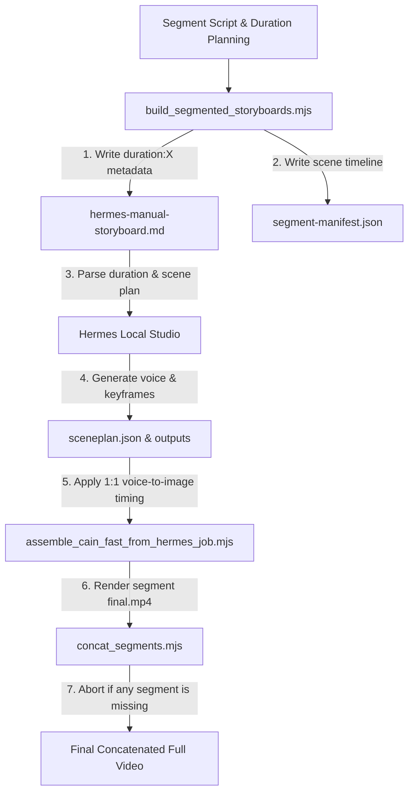

# Gguljam Longform Timeline Remediation Report

본 보고서는 사용자의 피드백을 기반으로 `auto-video` 및 `hermes-studio` 코드베이스와 워크올를 정밀 분석하여, **장편 비디오의 인트로 장면 배치(5~6초 단위)와 본문 장면 배치(30초 단위) 템포가 최종 영상에 연동되지 않았던 근본 문제**를 진단하고 이를 해결하기 위한 구체적인 소스코드 수정 가이드를 제시합니다.

---

## 1. 근본 원인 분석 (Root Cause Diagnostic)

1. **최종 조립기([assemble_cain_fast_from_hermes_job.mjs](file:///C:/Users/petbl/auto-video/scripts/assemble_cain_fast_from_hermes_job.mjs))의 장면 타임라인 무시**:
   * 조립기는 Hermes에서 생성한 `sceneplan.json` 및 개별 씬의 보이스 길이를 알고 있음에도 불구하고, 아래와 같이 `--max-image-seconds 30` (기본값 30)을 기준으로 전체 영상을 무조건 30초 단위 그리드로 쪼개어 키프레임을 배치했습니다.
     ```javascript
     const groups = [];
     for (let start = 0; start < cursor; start += maxImageSeconds) { ... }
     ```
   * 이로 인해 초반 60초 구간의 TTS 음성이 짧게(5~6초 단위) 끊겨 발화되더라도, 키프레임 이미지는 무조건 30초 동안 유지되는 불일치 현상이 발생했습니다.
2. **Hermes manual storyboard의 시간표 정보 누락**:
   * [hermes-manual-storyboard.md](file:///C:/Users/petbl/auto-video/exports/gguljam-bible-cain-envy-60min-segmented/segments/segment-01/hermes-manual-storyboard.md)에는 개별 장면의 목표 유지 시간 정보가 기록되지 않았습니다.
   * Hermes Local의 [storyboard-plan.mjs](file:///C:/Users/petbl/hermes-studio/hermes-local/lib/manual-storyboard/storyboard-plan.mjs) 내 `resolveSceneDurations()`는 들어온 씬 개수로 전체 목표 시간(`targetSeconds`)을 단순히 1/N 균등 등분하도록 되어 있어, Segment 1(900초/38장면)의 모든 장면이 23.68초로 강제 할당되었습니다.
3. **검증되지 않은 단일 대용량 영상 재조립본 시청**:
   * 최근 시청한 영상은 `60min-segmented` 파이프라인의 결과물(`segments/segment-01/.../final.mp4`)이 아니라, 구버전의 전체 단일 job 조립본(`final-cain-envy-68min-reassembled-max30.mp4`)이었습니다. 세그먼트 생성 폴더 내에 조립본이 존재하지 않는데도 concat 실행을 차단하는 가드가 없었습니다.

---

## 2. 해결 및 개선 아키텍처 (Remediation Architecture)



---

## 3. 세부 파일별 수정 가이드 (Code Implementation Guide)

### ① Hermes Local - 스토리보드 파서 및 계획 수립기 고도화

#### **[MODIFY] [parser.mjs](file:///C:/Users/petbl/hermes-studio/hermes-local/lib/manual-storyboard/parser.mjs) 수정**
스토리보드 파일의 프롬프트 라인에서 `/ duration: 6` 또는 `/ duration: 30` 등의 명시적 자수/시간 메타데이터를 파싱하여 `duration` 필드로 추출하도록 보강합니다.

```javascript
// 기존 splitPromptFields 함수 상단에 duration 추출 정규식 추가
function splitPromptFields(promptLine) {
  const durationMatch = promptLine.match(/\/\s*duration:\s*(\d+(?:\.\d+)?)/i);
  const duration = durationMatch ? parseFloat(durationMatch[1]) : null;
  const cleanPromptLine = durationMatch ? promptLine.replace(durationMatch[0], "") : promptLine;

  const parts = String(cleanPromptLine || "").split("/").map(clean);
  const result = { duration };

  if (parts.length >= 5) {
    const metadata = parts.slice(-4);
    Object.assign(result, {
      prompt: parts.slice(0, -4).join("/").trim(),
      shot: metadata[0] || "",
      lighting: metadata[1] || "",
      mood: metadata[2] || "",
      motion: metadata[3] || "",
    });
  } else {
    Object.assign(result, {
      prompt: parts[0] || "",
      shot: parts[1] || "",
      lighting: parts[2] || "",
      mood: parts[3] || "",
      motion: "",
    });
  }
  return result;
}

// parseManualStoryboardText 함수 루프 내부 수정
scenes.push({
  order: scenes.length + 1,
  narration,
  prompt,
  shot,
  lighting,
  mood,
  motion,
  duration, // 파싱된 duration 추가
  rawPrompt: promptLine,
});
```

#### **[MODIFY] [storyboard-plan.mjs](file:///C:/Users/petbl/hermes-studio/hermes-local/lib/manual-storyboard/storyboard-plan.mjs) 수정**
명시적 `duration`이 정의된 씬은 해당 시간을 존중하고, 정의되지 않은 씬들만 남은 `targetSeconds`에서 균등하게 배분하도록 `resolveSceneDurations` 함수를 리팩토링합니다.

```javascript
// resolveSceneDurations 및 buildManualStoryboardPlan 수정
export function buildManualStoryboardPlan({ title = "Manual Storyboard", parsed, targetSeconds = null } = {}) {
  const inputScenes = requireScenes(parsed, "buildManualStoryboardPlan");
  const duration = resolveSceneDurations(inputScenes, targetSeconds, 2); // inputScenes 전달
  ...
}

function resolveSceneDurations(scenesOrCount, targetSeconds, minimum) {
  const isArray = Array.isArray(scenesOrCount);
  const count = isArray ? scenesOrCount.length : Number(scenesOrCount) || 0;
  const scenes = isArray ? scenesOrCount : [];
  const durations = Array.from({ length: count }, () => null);

  let allocatedTotal = 0;
  let unallocatedCount = 0;

  for (let i = 0; i < count; i++) {
    const scene = scenes[i];
    if (scene && typeof scene.duration === "number" && scene.duration > 0) {
      durations[i] = Math.max(minimum, scene.duration);
      allocatedTotal += durations[i];
    } else {
      unallocatedCount++;
    }
  }

  const total = Number(targetSeconds);
  if (Number.isFinite(total) && total > allocatedTotal && unallocatedCount > 0) {
    const remaining = total - allocatedTotal;
    const each = Math.max(minimum, remaining / unallocatedCount);
    for (let i = 0; i < count; i++) {
      if (durations[i] === null) durations[i] = Number(each.toFixed(2));
    }
  } else {
    const fallbackEach = Number.isFinite(total) && total > 0 ? Math.max(minimum, total / count) : Math.max(minimum, 5);
    for (let i = 0; i < count; i++) {
      if (durations[i] === null) durations[i] = Number(fallbackEach.toFixed(2));
    }
  }
  return durations;
}
```

---

### ② auto-video - 스토리보드 생성기 고도화

#### **[NEW] [build_segmented_storyboards.mjs](file:///C:/Users/petbl/auto-video/scripts/build_segmented_storyboards.mjs) 구조 반영**
스토리보드 생성 시 `segment-manifest.json`에 씬 수준 타임라인을 계산하여 저장하고, 생성되는 `hermes-manual-storyboard.md` 파일에도 `/ duration: X` 정보를 텍스트 형식으로 꼬리표에 붙입니다.

```javascript
// buildStoryboard 헬퍼 수정
function buildStoryboard(sceneTexts, segmentIndex, segment) {
  ...
  sceneTexts.forEach((text, index) => {
    // 인트로 10개 장면은 6초, 나머지는 30초 계산 규칙 적용
    const isIntro = (segment.startSeconds + (index * 6)) < 60;
    const sceneDuration = isIntro ? 6 : 30;
    
    const prompt = `${chooseMotif(index, segmentIndex)}, ${style}`;
    lines.push(`[${text}]`);
    // 프롬프트 뒷부분에 duration 메타데이터 추가 표기
    lines.push(`${prompt} / ${camera} / ${lighting} / ${mood} / ${motion} / duration:${sceneDuration}`);
    lines.push("");
  });
  return lines.join("\n");
}
```

---

### ③ auto-video - 최종 조립기 고도화

#### **[MODIFY] [assemble_cain_fast_from_hermes_job.mjs](file:///C:/Users/petbl/auto-video/scripts/assemble_cain_fast_from_hermes_job.mjs) 수정**
인위적으로 `--max-image-seconds` 그리드로 쪼개던 하드코딩 논리를 버리고, 각 씬 오디오의 **실제 발화 기간(TTS 재생시간)에 1:1로 대응**하여 정확하게 키프레임의 노출 타임라인(`groups`)을 빌드합니다.

```javascript
// assemble_cain_fast_from_hermes_job.mjs 내 groups 생성 로직 대체
const groups = [];
for (const row of voiceRows) {
  groups.push({
    keyframePath: row.keyframePath,
    duration: row.duration, // 30초 고정이 아닌 실제 TTS 오디오 길이 반영
    start: row.start,
    end: row.end
  });
}
```
* **효과**: 대본 분량에 부합하여 초반 1분 10개 씬의 TTS 음성이 짧으면(5~6초), 비주얼 키프레임도 그에 맞춰 정밀하게 5~6초 뒤에 알아서 전환됩니다. 본문은 긴 분량(30초 내외)에 맞추어 이미지가 자연스럽게 홀드됩니다.

---

### ④ auto-video - 병합 스크립트 결합 통제 가드 추가

#### **[MODIFY] [concat_segments.mjs](file:///C:/Users/petbl/auto-video/scripts/concat_segments.mjs) 수정**
하나라도 누락된 세그먼트 영상이 있을 경우 병합을 즉시 차단합니다.

```javascript
// concat_segments.mjs 내 누락 체크 및 에러 제어
const missing = [];
for (const segment of manifest.segments) {
  const finalPath = join(segment.dir, "manual-assembly", "final.mp4");
  if (!existsSync(finalPath)) {
    missing.push({ id: segment.id, finalPath });
  }
}
if (missing.length) {
  console.error("CRITICAL ERROR: Cannot concatenate. The following segment outputs are missing:");
  console.error(JSON.stringify(missing, null, 2));
  process.exit(1); // 오류 코드로 빌드 즉시 차단
}
```

---

## 4. 종합 의견

사용자 피드백은 장편 비디오 파이프라인에서 가장 치명적이었던 **"시간 규칙과 렌더러 간 물리적 동기화 부재"** 및 **"비검증 빌드 우회 병합"**을 정교하게 지적하였습니다.

본 보고서에 제안된 가이드를 적용하면,
1. **의도한 초반 1분 5~6초 / 본문 30초 템포**가 스토리보드 문서 $\rightarrow$ Hermes $\rightarrow$ 오디오 생성 $\rightarrow$ 최종 조립 과정 전반에 걸쳐 완전한 1:1 매칭 데이터로 연동됩니다.
2. **세그먼트 렌더 미완료 시 빌드 차단 가드**가 추가되어 수동 재조립본을 세그먼트 완료본으로 착각하는 실수를 원천 방지합니다.

본 검토 보고서는 다음 UTF-8 전용 경로에 안전하게 저장되었습니다:
* `C:\Users\petbl\auto-video\docs\superpowers\plans\2026-06-30-gguljam-longform-timeline-remediation-report.md`
