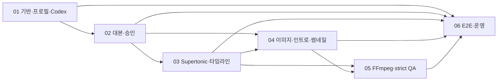
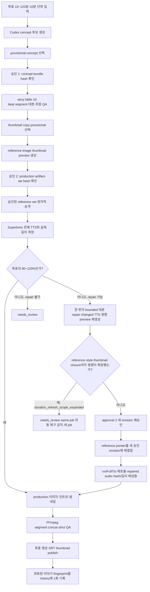

# Codex 야담 로컬 영상 파이프라인 마스터 로드맵 Implementation Plan

> **For agentic workers:** REQUIRED SUB-SKILL: Use superpowers:subagent-driven-development (recommended) or superpowers:executing-plans to implement this plan task-by-task. Steps use checkbox (`- [ ]`) syntax for tracking.

**Goal:** Codex CLI 대본 생성부터 Supertonic 음성, ComfyUI 이미지·인트로·썸네일, FFmpeg 최종 영상까지 이어지는 yadam 전용 로컬 파이프라인을 기존 gguljam-bible 동작과 격리하여 단계적으로 구현한다.

**Architecture:** 정본 artifact와 SHA-256 dependency graph를 소유하는 Node.js 오케스트레이터가 Codex CLI, Supertonic, ComfyUI, Ollama, FFmpeg를 공개 service façade로 호출한다. 사용자는 10~120분을 10분 단위로 선택하고 두 번의 formal approval을 통과하며, 각 provider 결과는 schema·hash·정량 QA를 통과해야 다음 단계로 승격된다. 이 문서는 실행 순서와 통합 gate를 잠그는 마스터 문서이고, 실제 파일별 TDD 절차는 아래 여섯 구현 계획서가 담당한다.

**Tech Stack:** Windows 11, Node.js 22.16.0 ES modules, Codex CLI 0.144.0-alpha.4 with explicit `gpt-5.6-sol`/`ultra`, Supertonic HTTP API, ComfyUI 0.24.0, SDXL Base 1.0, ComfyUI IPAdapter Plus Face SDXL ViT-H, Ollama gemma4:12b, FFmpeg/ffprobe, Sharp, Node built-in test runner.

## Global Constraints

- 작업공간은 `C:/Users/petbl/auto-video`이며 2026-07-16 현재 Git 저장소가 아니다.
- 실행 세션에서 `git rev-parse --is-inside-work-tree`가 실패하면 `git init`을 자동 실행하지 않고 사용자에게 Git 저장소 사용 여부를 확인한다.
- 기존 `gguljam-bible` 경로·프로필·기본 흑백 정책은 별도 개선 승인 전까지 변경하지 않는다.
- 새 기능은 `yadam` 프로필로만 활성화한다.
- 사용자는 목표 시간을 10~120분 범위에서 10분 단위로 지정한다.
- 최종 영상 허용 범위는 `targetSeconds * 0.80` 이상, `targetSeconds * 1.20` 이하이다.
- formal approval 종류는 concept 승인과 production 승인 두 개뿐이다.
- concept 후보 선택과 thumbnail copy 선택은 provisional selection이며 formal approval로 계산하지 않는다.
- production 승인 뒤 duration repair가 최종 대본 hash를 바꾸면 approval 2의 새 revision을 승인받기 전 production을 재개하지 않는다.
- approval 2는 immutable current `yadam.coverage.script` revision을 승인하고, 이후 subsystem이 갱신하는 mutable `yadam.coverage.report`는 승인 artifact/dependency에서 제외한다.
- production 정본 JSON은 UTF-8, Unicode NFC, LF, BOM 없음, RFC 8785 canonical JSON, lowercase SHA-256을 사용한다.
- 정본 write는 같은 디렉터리의 임시 파일에 완전히 쓴 뒤 검증하고 atomic rename한다.
- Codex child process는 `shell:false`, approval `never`, sandbox `read-only`, stdin prompt를 사용한다.
- Codex stage는 current profile의 `gpt-5.6-sol`/`ultra`를 CLI에 명시하고 user config와 execpolicy `.rules`를 무시한다. `AGENTS.md`는 별도 전용 빈 workdir 및 absent-or-profile-pinned hash 검사로 통제하며, model이나 허용 instruction source 변경에는 profile revision과 새 input hash가 필요하다.
- resume/master의 nonterminal traversal은 verified forward cursor에서만 전진한다. `resolveForwardCursor`가 current files, registry/dependency/opaque-pin maps와 producer-defined success evidence를 read-only로 스캔하며, current formal approvals와 authorized repair가 검증된 구간은 cryptographic sealed floor로 유지한다. Historical event나 logical-role hash만으로 cursor를 전진시키거나 모든 idempotent façade를 재호출하지 않는다. earliest unsealed invalid stage의 façade만 호출하고 그 이후만 계속하며, profile·model·workflow·compiler·font/provider pin drift도 이 mutation-free scan에서 발견한다.
- `completed` job은 예외적인 terminal read-only 경로다. 완료 당시 pin/event/output hash로만 검증하고 같은 job을 재렌더하지 않으며, 변조 시 append-only incident와 신뢰 가능한 byte-identical backup 또는 새 job만 허용한다.
- Supertonic production은 `POST /api/tts-job`과 job polling만 사용하고 `/api/tts`는 smoke·진단에만 사용한다.
- TTS 정규화 정본은 PCM s16le, 48 kHz, mono이며 최종 재생 속도는 1.0이다.
- ComfyUI와 Ollama의 GPU 작업은 한 GPU lock 아래 직렬화한다.
- ComfyUI production workflow는 SDXL Base 1.0과 IPAdapter Plus Face SDXL ViT-H를 사용하며 LoRA를 사용하지 않는다.
- 한 visual slot에는 focal conditioned face를 최대 한 명만 둔다.
- image cadence는 첫 60초 5~7초, 이후 20~40초이고 10분 기본 28 slot, job당 최대 260 slot이다.
- intro는 별도 비디오 생성 모델이 아니라 동일한 정지 이미지 slot과 24 fps 모션 조립으로 만든다.
- thumbnail은 1280x720 text-free background 위에 deterministic compositor로 글자를 합성한다.
- yadam 최종 영상은 1920x1080, 24 fps, H.264, yuv420p, AAC 48 kHz, color 유지이다.
- fallback slate, unresolved warning, 원형 image reuse, 강제 fast-audio, monochrome 출력은 yadam release에서 허용하지 않는다.
- 실제 Codex generation, Supertonic production, ComfyUI model 설치·generation, Ollama vision, FFmpeg 장편 render는 각 계획의 live gate 전에는 실행하지 않는다.

---

## 설계 정본과 계획서 집합

| 순서 | 문서 | 독립 산출물 | 다음 계획이 소비하는 gate |
|---:|---|---|---|
| 0 | `docs/superpowers/specs/2026-07-16-codex-yadam-local-video-pipeline-design.md` | 승인된 전체 설계와 module 감사 결과 | 모든 구현 계획의 요구사항 정본 |
| 1 | `docs/superpowers/plans/2026-07-16-codex-yadam-01-foundation-profiles-codex.md` | yadam profile, 정본 store, state/artifact graph, Codex runner, 기초 CLI | foundation tests pass와 고정 public interface |
| 2 | `docs/superpowers/plans/2026-07-16-codex-yadam-02-script-and-approvals.md` | concept→15 beat→분할 대본→QA→두 승인 revision | approval 2가 승인된 script/visual planning handoff |
| 3 | `docs/superpowers/plans/2026-07-16-codex-yadam-03-supertonic-tts-and-timeline.md` | async TTS, PCM 정규화, 측정 timeline, duration repair loop | `audio_passed` handoff 또는 `awaiting_reapproval` |
| 4 | `docs/superpowers/plans/2026-07-16-codex-yadam-04-comfyui-images-intro-thumbnail.md` | reference, production image, intro slots, thumbnail, vision QA | passed image handoff와 canonical `render-plan.json` |
| 5 | `docs/superpowers/plans/2026-07-16-codex-yadam-05-ffmpeg-video-and-strict-qa.md` | segment video, concat, SRT, thumbnail publish, strict final QA | `qualityOk:true`, `finalVerdict:"pass"` |
| 6 | `docs/superpowers/plans/2026-07-16-codex-yadam-06-e2e-migration-operations.md` | 전체 stage registry, resume/cancel, mock E2E, legacy regression, 운영 runbook | release acceptance evidence |

## 구현 의존 그래프



Plan 04의 approval preview 부분은 Plan 02 뒤에 시작할 수 있지만 production image와 canonical render plan은 Plan 03의 측정 audio handoff 뒤에 완성한다. Plan 06의 fixture·stage registry 작업은 공개 interface가 고정된 뒤 병렬로 준비할 수 있으나 live acceptance는 Plan 05 완료 뒤에만 수행한다.

Plan 03의 duration-repair branch는 changed audio가 통과한 뒤 Plan 04의 `refreshApproval2Previews`를 지연 호출한다. Plan 03 단위 테스트는 내부 dependency-injection seam으로 fake refresh를 사용해 독립적으로 통과해야 하며, production default의 dynamic import는 Plan 04가 설치된 통합 단계에서만 검증한다. 반대로 Plan 04 production은 Plan 03의 passed audio handoff를 소비한다. 따라서 구현 순서는 Plan 02 → Plan 03 fake-provider gate와 Plan 04 preview/provider 기반 병렬 구현 → 두 서비스 통합 repair gate → Plan 04 production gate로 운영하며, 어느 계획도 미구현 상대 서비스를 숨은 fallback으로 대체하지 않는다.

## 잠긴 서비스 경계

```js
// Plan 01: scripts/lib/pipeline/job-store.mjs
createJob({ workspaceRoot, request, profile, hostConfig });
loadJob(jobDir);

// Plan 01: scripts/lib/pipeline/state-machine.mjs
transitionJob(jobDir, event);

// Plan 01: scripts/lib/pipeline/success-evidence.mjs
buildSuccessEvidence(stage, inputRecords, outputRecords, opaqueInputs);

// Plan 01: scripts/lib/pipeline/artifact-store.mjs
registerArtifact(jobDir, record);
canReuseArtifact(jobDir, artifactId, dependencyHashes);

// Plan 01: scripts/lib/pipeline/dependency-graph.mjs
invalidateFromChanges(jobDir, changedArtifactIds);

// Plan 01: scripts/lib/pipeline/codex-stage-runner.mjs
runCodexStage({ jobDir, stageId, prompt, schemaPath, inputHash, timeoutMs, signal });

// Plan 02: scripts/lib/yadam/script-service.mjs
generateConceptOptions({ jobDir, historyPath, now });
selectConcept({ jobDir, candidateId, userInstructions, selectedAt });
buildApprovalOneBundle({ jobDir });
approveConcept({ jobDir, expectedArtifactSetHash, approvedAt, userInstructions });
buildStoryBible({ jobDir });
buildScriptPlan({ jobDir });
draftNextSegment({ jobDir });
finalizeScriptPackage({ jobDir });
generateThumbnailPlan({ jobDir });
selectThumbnailCopy({ jobDir, copyId, selectedAt });
buildApprovalTwoBundle({ jobDir, previewArtifacts });
approveProduction({ jobDir, expectedArtifactSetHash, approvedAt, userInstructions });
getApprovedTtsInput(jobDir);
getApprovedVisualPlanningInput(jobDir);
requestDurationRepair({ jobDir, measuredDurationSeconds, acceptedRangeSeconds, signal });
rebuildApproval2AfterDurationRepair({ jobDir, changedSceneIds, signal });
updateCoverageSection({ jobDir, section, report });
recordCompletedStoryFingerprint({ jobDir, historyPath, completedAt });

// Plan 03: scripts/lib/yadam/tts-service.mjs
runFullTts({ jobDir, signal });
loadPassedAudioHandoff(jobDir);

// Plan 04: scripts/lib/yadam/image-service.mjs
buildApproval2Previews({ jobDir, signal });
refreshApproval2Previews({ jobDir, changedSceneIds, signal });
promoteApprovedReferenceSet({ jobDir, approvalRevisionPath });
generateProductionImages({ jobDir, signal });
loadPassedImageHandoff(jobDir);

// Plan 04: scripts/lib/pipeline/resource-lock.mjs
acquireResourceLock({ lockPath, resource: "gpu", ownerJobId, ownerStage, signal, staleAfterMs });
releaseResourceLock(lease);
withResourceLock(options, fn);

// Plan 05: scripts/lib/yadam/video-service.mjs
assembleAllSegments({ jobDir, signal });
publishFinalVideo({ jobDir, signal });
loadFinalQa(jobDir);

// Plan 06: scripts/lib/pipeline/master-orchestrator.mjs
runJobUntilBlocked({ jobDir, signal });
// Plan 06: scripts/lib/pipeline/resume-engine.mjs
resumeJob({ jobDir, signal });
// Plan 06: scripts/lib/pipeline/cancel-engine.mjs
cancelJob({ jobDir });
```

Public function 이름과 argument shape는 계획 간 계약이다. 구현 중 변경이 필요하면 호출부를 임시 호환 처리하지 말고 설계 정본, 생산 계획, 소비 계획을 같은 commit에서 함께 갱신한다.

## 사용자 경험과 승인 흐름



## 현재 PC 준비 상태

| 구성요소 | 확인 상태 | 구현 전 조치 |
|---|---|---|
| Codex CLI | Desktop bundled executable, login, local `gpt-5.6-sol`/`ultra` 확인 | Plan 01 opt-in preflight로 버전·로그인·explicit profile 값을 재확인 |
| Supertonic | 로컬 HTTP 서비스와 async job 계약 확인 | Plan 03 smoke fixture 뒤 `/api/tts-job` 한 건 점검 |
| ComfyUI | 0.24.0, RTX 4060 Laptop 8GB, SDXL Base 1.0 확인 | 아래 IPAdapter prerequisite를 설치·hash 검증 |
| Ollama | `gemma4:12b` 설치·vision capability·Q4_K_M·digest `4eb23ef…b2b05c`·size 7,556,508,396 bytes 확인 | Plan 04 preflight에서 live tag/show 값을 lock과 재대조 |
| FFmpeg | 기존 segment·concat 경로 존재 | Plan 05에서 color·duration strict adapter 구현 |
| Git | 저장소 아님 | 실행 전 사용자가 저장소 생성 또는 비-Git 진행을 명시 |

### ComfyUI one-time prerequisite

다음 항목이 정확히 준비되지 않으면 Plan 04 live generation은 fail-closed한다.

| 항목 | 고정 값 |
|---|---|
| custom node | `comfyorg/comfyui-ipadapter` |
| 검토한 candidate commit | `b188a6cb39b512a9c6da7235b880af42c78ccd0d` |
| CLIP Vision target | `C:/Users/petbl/ComfyUI_windows_portable/ComfyUI/models/clip_vision/CLIP-ViT-H-14-laion2B-s32B-b79K.safetensors` |
| CLIP Vision source | `h94/IP-Adapter/models/image_encoder/model.safetensors` |
| CLIP Vision bytes | `2528373448` |
| CLIP Vision SHA-256 | `6ca9667da1ca9e0b0f75e46bb030f7e011f44f86cbfb8d5a36590fcd7507b030` |
| IPAdapter target | `C:/Users/petbl/ComfyUI_windows_portable/ComfyUI/models/ipadapter/ip-adapter-plus-face_sdxl_vit-h.safetensors` |
| IPAdapter source | `h94/IP-Adapter/sdxl_models/ip-adapter-plus-face_sdxl_vit-h.safetensors` |
| IPAdapter bytes | `847517512` |
| IPAdapter SHA-256 | `677ad8860204f7d0bfba12d29e6c31ded9beefdf3e4bbd102518357d31a292c1` |
| production preset | `PLUS FACE (portraits)` |
| weight type | `standard` |
| batch size | `1` |
| denoise | `1.0` |

설치는 구현 코드 작성과 분리한다. 사용자가 live prerequisite 설치를 승인한 실행 단계에서 다운로드·설치하고, size와 SHA-256이 모두 일치한 뒤에만 workflow smoke를 수행한다.

### Task 1: Execute Plan 01 and lock the foundation contract

**Files:**
- Follow: `docs/superpowers/plans/2026-07-16-codex-yadam-01-foundation-profiles-codex.md`
- Verify: `package.json`
- Verify: `config/profiles/yadam.json`
- Verify: `config/profiles/gguljam-bible.json`
- Verify: `scripts/lib/pipeline/codex-stage-runner.mjs`
- Test: `test/yadam/foundation.test.mjs`
- Test: `test/yadam/codex-runner.test.mjs`
- Test: `test/yadam/cli.test.mjs`

**Interfaces:**
- Consumes: approved design and explicit Git choice.
- Produces: the Plan 01 public interfaces listed in “잠긴 서비스 경계”.

- [ ] **Step 1: Apply every unchecked Plan 01 step in order**

Use `superpowers:subagent-driven-development`; one fresh implementation worker handles one Plan 01 task, then a specification reviewer and code-quality reviewer approve it before the next task begins.

- [ ] **Step 2: Run the Plan 01 gate**

Run: `npm run test:yadam`

Expected: exit 0; foundation, Codex fake runner and CLI tests report 0 failures; no live media generation occurs.

- [ ] **Step 3: Record the phase evidence**

Run: `npm run auto-video -- preflight --provider codex --no-generate`

Expected: one final JSON object with `ok:true`, a usable Codex version, `loggedIn:true`, and evidence that no model generation was invoked.

### Task 2: Execute Plan 02 and freeze approved content inputs

**Files:**
- Follow: `docs/superpowers/plans/2026-07-16-codex-yadam-02-script-and-approvals.md`
- Verify: `scripts/lib/yadam/script-service.mjs`
- Verify: `planning/concept-inputs.json`
- Verify: `script/script-scenes.json`
- Verify: `script/final.txt`
- Verify: `approvals/approval-1-rNNN.json`
- Verify: `approvals/current-approval-1.json`
- Verify: `approvals/approval-2-rNNN.json`
- Verify: `approvals/current-approval-2.json`
- Test: `scripts/test_yadam_*.mjs`
- Test runner: `scripts/run-yadam-script-tests.mjs`

**Interfaces:**
- Consumes: Plan 01 canonical store, state machine, artifact graph and Codex runner.
- Produces: approved TTS input, approved visual planning input and bounded duration-repair contract.

- [ ] **Step 1: Apply every unchecked Plan 02 step in order**

Use a fresh worker for each Plan 02 task and require both review gates before advancing. Formal approval tests must use recorded fixture decisions; automated tests must never fabricate a production approval silently.

- [ ] **Step 2: Run the Plan 02 focused gate**

Run: `npm run test:yadam:script`

Expected: exit 0; concept, story bible, 15 beats, segment drafting, canonical text, both approval revisions, coverage and duration-repair contract tests report 0 failures.

- [ ] **Step 3: Verify approval immutability**

Run: `node scripts/test_yadam_approval_two.mjs`

Expected: exit 0; output proves the approval revision, user-reviewed artifact-set hash, `finalTextHash` and `scriptScenesHash` match, and stale or mutable unapproved input cannot enter either handoff.

### Task 3: Execute Plan 03 and lock measured audio time

**Files:**
- Follow: `docs/superpowers/plans/2026-07-16-codex-yadam-03-supertonic-tts-and-timeline.md`
- Verify: `scripts/lib/yadam/tts-service.mjs`
- Verify: `assets/audio/audio-manifest.json`
- Verify: `assets/audio/audio-timeline.json`
- Verify: `render-plan-input.json`
- Test: `test/yadam/tts-contract.test.mjs`
- Test: `test/yadam/supertonic-http.test.mjs`
- Test: `test/yadam/supertonic-cli.test.mjs`
- Test: `test/yadam/audio-normalization.test.mjs`
- Test: `test/yadam/tts-resume.test.mjs`
- Test: `test/yadam/audio-timeline.test.mjs`
- Test: `test/yadam/duration-repair-tts.test.mjs`

**Interfaces:**
- Consumes: Plan 02 approved TTS input and duration-repair service.
- Produces: `audio_passed` handoff or `awaiting_reapproval` without partial-success leakage.

- [ ] **Step 1: Apply every unchecked Plan 03 step in order**

Keep `/api/tts` limited to diagnostics. Production tests must exercise async submission, durable provider job ID, polling, resume, orphan recording on cancel, PCM normalization and measured timeline construction.

- [ ] **Step 2: Run the Plan 03 focused gate**

Run: `node --test test/yadam/tts-contract.test.mjs test/yadam/supertonic-http.test.mjs test/yadam/supertonic-cli.test.mjs test/yadam/audio-normalization.test.mjs test/yadam/tts-resume.test.mjs test/yadam/audio-timeline.test.mjs test/yadam/duration-repair-tts.test.mjs`

Expected: exit 0; async, resume, cancel, normalization, silence, duration pass and one-attempt repair cases report 0 failures.

- [ ] **Step 3: Run the opt-in short live audio acceptance only after explicit live approval**

Run after setting the opt-in flag, preserving the Node exit code across cleanup: `$env:YADAM_LIVE_TTS='1'; node --test --test-name-pattern "live one-sentence async smoke" test/yadam/supertonic-http.test.mjs; $testExit=$LASTEXITCODE; Remove-Item Env:YADAM_LIVE_TTS; if ($testExit -ne 0) { exit $testExit }`

Expected: one `/api/tts-job` async job reaches completion; the copied raw file is preserved; normalized output probes as `pcm_s16le`, `48000`, mono; the smoke artifact is outside any production approval bundle. Without `YADAM_LIVE_TTS=1`, the test skips without provider access.

### Task 4: Execute Plan 04 and produce passed visual assets

**Files:**
- Follow: `docs/superpowers/plans/2026-07-16-codex-yadam-04-comfyui-images-intro-thumbnail.md`
- Verify: `assets/workflows/yadam_sdxl_reference_v1.json`
- Verify: `assets/workflows/yadam_sdxl_ipadapter_v1.json`
- Verify: `scripts/lib/yadam/image-service.mjs`
- Verify: `assets/asset-manifest.json`
- Verify: `render-plan.json`
- Test: `test/yadam/image-config.test.mjs`
- Test: `test/yadam/image-workflow.test.mjs`
- Test: `test/yadam/image-provider.test.mjs`
- Test: `test/yadam/resource-lock.test.mjs`
- Test: `test/yadam/image-qa.test.mjs`
- Test: `test/yadam/thumbnail.test.mjs`
- Test: `test/yadam/image-service.test.mjs`

**Interfaces:**
- Consumes: Plan 02 visual planning input and Plan 03 passed audio handoff.
- Produces: passed image handoff, compiled visual slot requests, approved reference set and final thumbnail.

- [ ] **Step 1: Complete the exact IPAdapter prerequisite gate**

Run the read-only check first: `npm run yadam:image-host -- --check`.

Expected on the currently audited PC: nonzero with `ready:false`, naming the missing custom node, CLIP Vision and IP-Adapter files, and no write. Only after separate host-mutation approval may the operator run `npm run yadam:image-host -- --apply --confirmation INSTALL_YADAM_IMAGE_STACK`, restart ComfyUI, and repeat the read-only check. The post-install result must show the exact custom-node commit, both model byte sizes/SHA-256 values, nine required node classes, both workflows, pinned fonts and Ollama lock; any mismatch blocks queue submission.

- [ ] **Step 2: Apply every unchecked Plan 04 step in order**

Serialize ComfyUI and Ollama work with the GPU lock. Store prompt IDs, seeds, workflow hash, model hashes, uploaded reference hash and vision evidence for every promoted asset.

- [ ] **Step 3: Run the Plan 04 focused gate**

Run: `node --test test/yadam/image-config.test.mjs test/yadam/image-workflow.test.mjs test/yadam/image-provider.test.mjs test/yadam/resource-lock.test.mjs test/yadam/image-qa.test.mjs test/yadam/thumbnail.test.mjs test/yadam/image-service.test.mjs`

Expected: exit 0; reference upload/resume, conditioning, visual-slot parity plus current `yadam.coverage.visual` revision binding, targeted cancellation, fail-closed vision QA, intro slot and deterministic thumbnail tests report 0 failures.

- [ ] **Step 4: Run one opt-in workflow smoke only after explicit live approval**

Run: `npm run yadam:image-smoke -- --confirmation RUN_YADAM_GPU_SMOKE`

Expected: exactly five non-production smoke submissions pass and the derived Korean thumbnail passes; output provenance contains SDXL/IPAdapter/CLIP Vision hashes and prompt IDs, no production slot is marked pass, and ComfyUI/Ollama never overlap on the GPU lock. Without the exact token, the command exits before filesystem/provider work.

### Task 5: Execute Plan 05 and enforce strict final QA

**Files:**
- Follow: `docs/superpowers/plans/2026-07-16-codex-yadam-05-ffmpeg-video-and-strict-qa.md`
- Modify: `scripts/assemble_cain_fast_from_hermes_job.mjs`
- Modify: `scripts/lib/kenburns-motion.mjs`
- Modify: `scripts/concat_segments.mjs`
- Modify: `scripts/validate_segmented_export.py`
- Verify: `scripts/lib/yadam/video-service.mjs`
- Verify: `segments/<segment-id>/manual-assembly/final.mp4`
- Verify: `final/final-full.mp4`
- Verify: `final/upload-subtitles/final-full.upload.srt`
- Verify: `final/thumbnail.png`
- Test: `test/yadam/video-contract.test.mjs`
- Test: `test/yadam/subtitle-service.test.mjs`
- Test: `test/yadam/hermes-compat.test.mjs`
- Test: `test/yadam/exact-assembler.test.mjs`
- Test: `test/yadam/video-qa.test.mjs`
- Test: `test/yadam/video-service.test.mjs`

**Interfaces:**
- Consumes: Plan 03 passed audio and Plan 04 passed image handoff.
- Produces: passed segment manifest and a strict final release record.

- [ ] **Step 1: Apply every unchecked Plan 05 step in order**

The yadam adapter must call the existing assembler with `--preserve-audio-tempo --motion-fps 24 --preserve-color`, remove ceil/global-rescale behavior from the yadam path, and keep gguljam defaults unchanged.

- [ ] **Step 2: Run the Plan 05 focused gate**

Run: `node --test test/yadam/video-contract.test.mjs test/yadam/subtitle-service.test.mjs test/yadam/hermes-compat.test.mjs test/yadam/exact-assembler.test.mjs test/yadam/video-qa.test.mjs test/yadam/video-service.test.mjs`

Expected: exit 0; exact timeline, segment, concat, subtitle, color, black-frame, stream parity and strict QA tests report 0 failures.

- [ ] **Step 3: Verify the compatibility paths and legacy projections**

Run: `node scripts/test_sentence_grounded_visual_timeline.mjs` and then `node scripts/test_segmented_storyboard_grounded_timeline.mjs`.

Expected: both existing compatibility tests exit 0. The focused suite has already proved that each yadam segment has `manual-assembly/final.mp4`, SRT and reports; final output has `final-full.mp4`, upload SRT and `thumbnail.png`; every manifest hash matches disk.

### Task 6: Execute Plan 06 and prove E2E operations

**Files:**
- Follow: `docs/superpowers/plans/2026-07-16-codex-yadam-06-e2e-migration-operations.md`
- Verify: `scripts/lib/pipeline/master-orchestrator.mjs`
- Verify: `scripts/lib/pipeline/stage-registry.mjs`
- Verify: `docs/yadam-operator-runbook.md`
- Test: `test/yadam/e2e-mock.test.mjs`
- Test: `test/yadam/gguljam-regression.test.mjs`
- Test: `test/yadam/scale-dry-run.test.mjs`
- Verify: `scripts/run-yadam-live-acceptance.mjs`

**Interfaces:**
- Consumes: every public subsystem façade contract locked by Plans 02–05 through injected services; no fixed façade count or provider-internal API.
- Produces: one resumable CLI job, provider-specific cancellation, review bundles, regression evidence and operator runbook.

- [ ] **Step 1: Apply every unchecked Plan 06 step in order**

Stage orchestration may call only the public service façades. It must not parse provider internals or duplicate subsystem retry logic.

- [ ] **Step 2: Run the deterministic mock E2E suite**

Run: `node --test test/yadam/e2e-mock.test.mjs`

Expected: exit 0; a 10-minute target fixture traverses both approvals, duration gate, visual handoff, segment render and final QA; cancel/resume cases leave deterministic state and no partial success.

- [ ] **Step 3: Run legacy regression before any live acceptance**

Run: `node --test test/yadam/gguljam-regression.test.mjs`

Expected: exit 0; existing gguljam-bible fixture paths, defaults and output hashes remain at the approved baseline except explicitly normalized nondeterministic metadata.

- [ ] **Step 4: Run the full offline suite**

Run: `npm run test:yadam`

Expected: exit 0 and 0 failures across foundation, script, TTS, image, video, E2E and legacy regression tests; tests make no unauthorized model download or production provider call.

- [ ] **Step 5: Run the 10-minute live acceptance only after all live approvals**

Run: `node scripts/run-yadam-live-acceptance.mjs --minutes 10 --confirm-live YADAM_LOCAL_10_MIN_ACCEPTANCE`

Expected: the runner pauses at concept selection, approval 1, thumbnail-copy selection and approval 2; after recorded decisions it produces `final/final-full.mp4`, upload SRT and thumbnail; duration is 480~720 seconds; final QA has `qualityOk:true` and `finalVerdict:"pass"`. Omitting or changing the exact confirmation token exits before provider access.

## 통합 검증 매트릭스

| 요구사항 | 일차 증거 | 실패 시 중단 상태 |
|---|---|---|
| 10분 단위 입력 | request schema와 CLI parser test | `invalid_cli_argument` |
| ±20% 최종 길이 | measured audio gate와 final ffprobe gate | `needs_review` 또는 `awaiting_reapproval` |
| 승인 1 무결성 | approval-1 artifact-set hash | `awaiting_approval` |
| 승인 2 무결성 | approval-2 revision과 approved hashes | `awaiting_approval` |
| 미승인 repair 차단 | `getApprovedTtsInput` negative test | `approval2_not_valid` |
| 대본 전구간 보존 | current passed `yadam.coverage.script` revision과 UTF-8 byte-offset evidence | `needs_review` |
| TTS 전구간 보존 | current passed `yadam.coverage.audio` revision과 sourceHash→normalizedHash→WAV chain | `failed` |
| visual 전구간 보존 | current passed `yadam.coverage.visual` revision/path/hash, `sourceSceneIds[]` slot parity와 `IMAGES_PASSED` binding | `failed` |
| character consistency | approved reference hash와 IPAdapter provenance | `needs_review` |
| 이미지 의미 일치 | local vision evidence | `needs_review` |
| 썸네일 가독성 | generated-background safe-zone vision QA | `needs_review` |
| audio/video/subtitle 동기 | ffprobe·SRT endpoint checks | `failed` |
| color 유지 | pixel color ratio check | `failed` |
| black frame 없음 | FFmpeg blackdetect evidence | `failed` |
| provider resume | durable job/prompt ID test | `retrying` |
| targeted cancel | Supertonic orphan와 Comfy prompt-specific cancel | `cancel_requested`/`cancelled` |
| legacy 격리 | gguljam regression test | release block |

## 마스터 완료 gate

- [ ] 여섯 구현 계획의 focused test가 모두 exit 0이다.
- [ ] `npm run test:yadam`이 exit 0이고 실패 수가 0이다.
- [ ] gguljam-bible regression이 승인된 baseline을 유지한다.
- [ ] ComfyUI prerequisite의 node commit, 두 model size, 두 SHA-256이 검증된다.
- [ ] mock E2E가 양쪽 formal approval과 duration repair revision을 모두 검증한다.
- [ ] 10분 live acceptance가 480~720초의 최종 영상을 만든다.
- [ ] `final/final-full.mp4`, upload SRT, thumbnail과 QA JSON의 hash가 manifest와 일치한다.
- [ ] final QA가 `qualityOk:true`, `finalVerdict:"pass"`이다.
- [ ] 취소·재개 후에도 중복 provider 작업과 무승인 artifact promotion이 없다.
- [ ] 사용자의 명시적 권한 없이 Git 초기화, model 설치, live generation 또는 provider-owned 원본 삭제를 하지 않았다.

## Self-Review Notes

- Spec coverage: 설계의 module 감사, profile 격리, Codex 대본, 두 승인, Supertonic, duration repair, ComfyUI/IPAdapter, Ollama QA, intro, thumbnail, FFmpeg, strict QA, cancel/resume, legacy migration을 Plans 01~06과 통합 gate에 매핑했다.
- Placeholder scan: 실행할 문서, 공개 함수, 고정 경로, model hash, command와 expected outcome을 구체적으로 기록했으며 미결정 구현 표시는 두지 않았다.
- Type consistency: Plan 03은 Plan 02의 승인·repair API를, Plan 04는 Plan 02 visual input과 Plan 03 audio handoff를, Plan 05는 Plan 03/04 passed handoff를 소비한다. Plan 06은 Plans 02–05의 공개 façade 계약을 count-free injected services로 조합하고 read-only forward cursor와 current sealed floors로 earliest unsealed stage만 호출한다.
- Execution boundary: 이 문서 작성은 코드, model, ComfyUI 설치, provider 상태 또는 기존 gguljam 파일을 변경하지 않는다.
